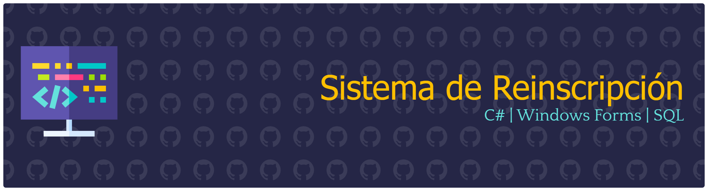

## Creador
- **Estudiante:** Natalia Valenzuela ([@NataliaVlza](https://github.com/NataliaVlza))
- **Institución:** Universidad de Sonora (UNISON)
- **Modalidad:** Proyecto guiado y desarrollado en sesiones prácticas de laboratorio.

---

## Descripción
Aplicación de escritorio en **C# (Windows Forms)** enfocada en la gestión de materias y procesos de reinscripción académica. El proyecto implementa arquitectura orientada a objetos, manejo de controles visuales avanzados y persistencia de datos mediante operaciones **CRUD** conectadas a una base de datos relacional.

### Funcionalidades y requisitos implementados:
- **Ventana Principal:** Consulta interactiva con `DataGridView` y barra de herramientas (`ToolStrip`) para las acciones principales (*Obtener*, *Agregar*, *Editar*, *Eliminar*, *Salir*).
- **Control de Modales:** Formulario dinámico `AgregarEditar` para el alta y modificación con validación de campos.
- **Modelo `Materia`:** Clase con propiedades de `ID`, `NombreMateria`, `Tipo` (Obligatoria, Optativa, Eje Formación Común), `Horario` y `Calificacion`.
- **Validación de Horarios:** Lógica de negocio que impide el empalme de horarios en materias registradas.
- **Persistencia:** Conexión y operaciones directas en la base de datos SQL.

## Imágenes del Proyecto

### 1. Ventana Principal
Muestra la interfaz inicial del sistema integrada con un **DataGridView** y una barra de herramientas (**ToolStrip**) con accesos rápidos a las operaciones principales.  

---

### 2. Formulario Agregar / Editar Materia
Ventana modal encargada de capturar y validar los datos de la materia (ID, Nombre, Tipo, Horario y Calificación). Incluye lógica para evitar duplicidad o empalme de horarios.  

  
---

### 3. Carga de Datos y Consulta
Representación del flujo al ejecutar el método **Obtener**, realizando una petición a la base de datos para recuperar e imprimir la lista actualizada de asignaturas.  

---

### 4. Confirmación de Eliminación
Cuadro de diálogo de confirmación previa a eliminar un registro seleccionado de la base de datos, garantizando integridad y prevención de borrados accidentales.  

