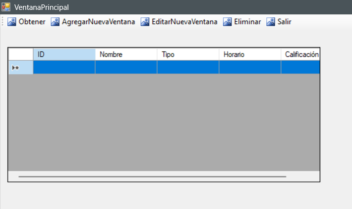
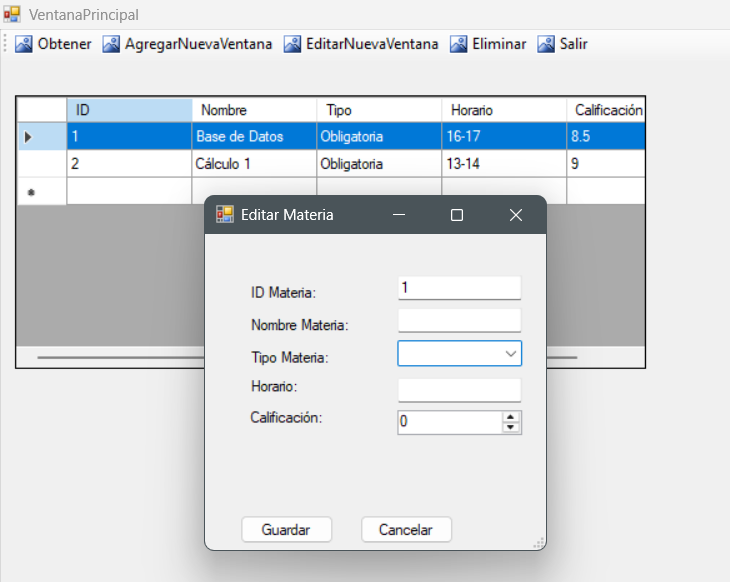
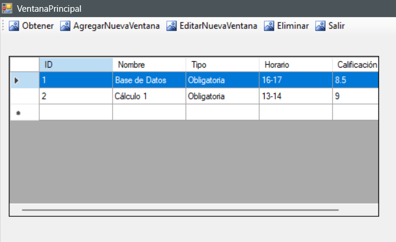
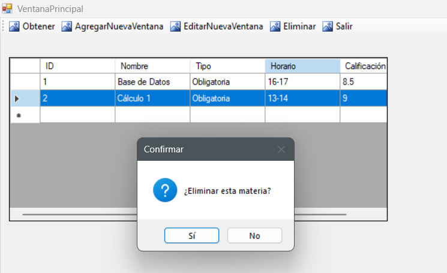

  

<h1 align="center">
  
</h1>

<b>Gestión de Materias y CRUD en C# Windows Forms | Universidad de Sonora</b>

 

<b>Creador y Modalidad</b>

* **Estudiante:** Natalia Valenzuela ([@NataliaVlza](https://github.com/NataliaVlza))
* **Institución:** Universidad de Sonora (UNISON) - Facultad Interdisciplinaria de Ingenierías
* **Modalidad:** Proyecto guiado y desarrollado en sesiones prácticas de laboratorio.
* **Contacto:** natalia.sanchezvlza@gmail.com
* **Ubicación:** Hermosillo, Sonora, México

 

<b>Descripción del Proyecto</b>

Aplicación de escritorio desarrollada en <b>C# (Windows Forms)</b> enfocada en la gestión interactiva de asignaturas y procesos de reinscripción académica. El proyecto implementa arquitectura orientada a objetos, manejo de controles visuales avanzados y persistencia de datos mediante operaciones <b>CRUD</b> conectadas a una base de datos relacional.

<b>Funcionalidades y Requisitos Implementados:</b>

* **Ventana Principal:** Consulta interactiva con `DataGridView` y barra de herramientas (`ToolStrip`) para las acciones principales (*Obtener*, *Agregar*, *Editar*, *Eliminar*, *Salir*).
* **Control de Modales:** Formulario dinámico `AgregarEditar` para el alta y modificación con validación de campos en tiempo de ejecución.
* **Modelo `Materia`:** Clase con propiedades de `ID`, `NombreMateria`, `Tipo` (Obligatoria, Optativa, Eje Formación Común), `Horario` y `Calificacion`.
* **Validación de Horarios:** Lógica de negocio que impide la duplicidad de registros y el empalme de horarios en materias registradas.
* **Persistencia Directa:** Conexión y ejecución de consultas SQL para el almacenamiento e integridad de la información.

 

<b>Imágenes del Proyecto</b>

<b>1. Ventana Principal</b> 
Interfaz inicial del sistema integrada con un <code>DataGridView</code> y una barra de herramientas (<code>ToolStrip</code>) con accesos rápidos a las operaciones principales.

 

<b>2. Formulario Agregar / Editar Materia</b> 
Ventana modal encargada de capturar y validar los datos de la materia (ID, Nombre, Tipo, Horario y Calificación). Incluye lógica para evitar duplicidad o empalme de horarios.

 

<b>3. Carga de Datos y Consulta</b> 
Representación del flujo al ejecutar el método <b>Obtener</b>, realizando una petición a la base de datos para recuperar e imprimir la lista actualizada de asignaturas.

 

<b>4. Confirmación de Eliminación</b> 
Cuadro de diálogo de confirmación previa a eliminar un registro seleccionado de la base de datos, garantizando integridad y prevención de borrados accidentales.

 

Créditos de componentes visuales: <a href="https://github.com/kyechan99/capsule-render/blob/main/docs/README_es.md">capsule-render</a> por @kyechan99 y <a href="https://github.com/denvercoder1">readme-typing-svg</a> por @DenverCoder1

  

